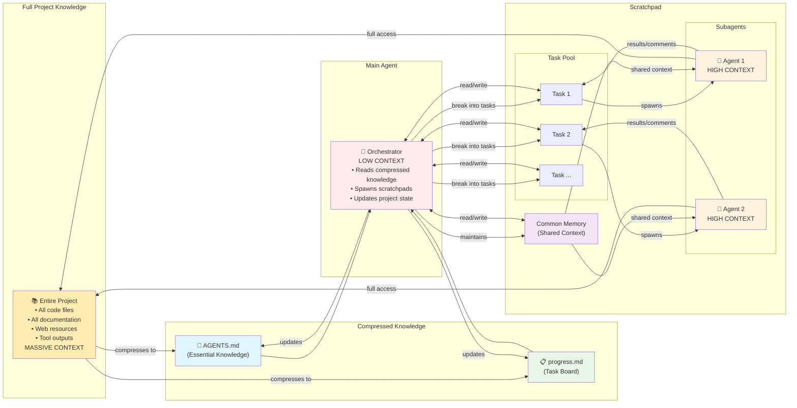
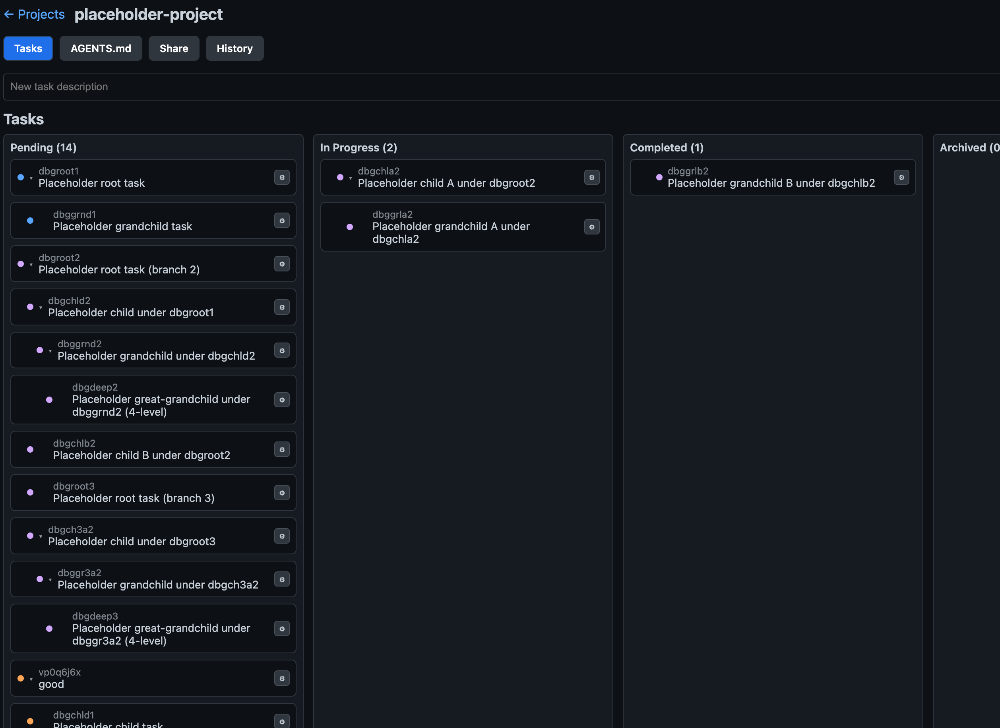

# mcp-http-agent-md


Minimal MCP (Model Context Protocol) HTTP server for AGENTS.md and structured tasks, with versioned history (logs/revert) and an ephemeral scratchpad, exposed over a Streamable HTTP endpoint. The scratchpad can also be used to spawn context isolated subagents (via Gemini, OpenAI, Groq, OpenAI‑compatible, or MCP + OpenAI‑compatible) for solving focused tasks. An auth midware is also provided for user isolation and public serving. Users can also share and collaborate on projects within the server.

Co-authored by Codex (OpenAI).

## Architecture Overview

This project implements a hierarchical context management system for AI agents working on long-term projects:



**Key Benefits:**
- **Project-wide context**: AGENTS.md stores accumulated knowledge, progress.md tracks long-term tasks, read more from [agents.md](https://agents.ms).
- **Task-wide context**: Scratchpads provide temporary but focused, manageable chunks with shared memory
- **Subagent isolation**: Each subagent only sees relevant context, preventing information overload
- **Low main agent context**: Orchestrator only needs high-level results, not detailed research
- **Persistent knowledge**: Project state survives across multiple chat sessions

## Automatic Install and User creation (Unix-like systems)

- Without docker: (Install to `$HOME/.config/mcp-http-agent-md` and start with a default user)
  ```bash
  curl -fsSL https://raw.githubusercontent.com/benhaotang/mcp-http-agent-md/main/install/install.sh | bash
  ```
- With docker: (Data persist in `$HOME/.config/mcp-http-agent-md/data`)
  ```bash
  curl -fsSL https://raw.githubusercontent.com/benhaotang/mcp-http-agent-md/main/install/install-docker.sh | bash
  ```

## Manual Install

First, clone the repo: `git clone https://github.com/benhaotang/mcp-http-agent-md.git`

### Environments

You can set all Environments defined in [.env.example](./.env.example) in Terminal via `export XXX=xxx`.

If you prefer setting them via `.env`: `cp .env.example .env`

- Server defaults: `HOST=localhost`, `PORT=3000`, `BASE_PATH=/mcp`.
- External AI (optional): set in `.env` or ENV when using the subagent tools. Learn more about supported [Providers and models](#providers-and-models).
```
USE_EXTERNAL_AI=true
AI_API_TYPE=google   # google | openai | groq | compat | mcp
AI_API_KEY=...   # required when enabled
AI_MODEL="gemini-2.5-pro"  # optional; default depends on provider
AI_TIMEOUT=120              # optional
AI_ATTACHMENT_TEXT_LIMIT=120000  # optional; -1 keeps full extracted text
```

> [!NOTE]
> For docker, we currently only support adding them via `-e XXX=xxx` for security. If you want to use `.env` file, remove it from `.dockerignore` and build the image locally. See [Docker](#docker).

### Run with Node

- pnpm (recommended):
  - Install: `pnpm install`
  - Dev: `pnpm dev`
  - Prod: `pnpm start`
- npm:
  - Install: `npm install`
  - Dev: `npx nodemon --watch index.js --ext js,mjs,cjs index.js`
  - Prod: `npm run start`

### Docker

- From GitHub Package: `docker pull ghcr.io/benhaotang/mcp-http-agent-md:latest`
  - Run (persist DB and set admin key):
   ```
    docker run -it --restart always \
      -p 3000:3000 \
      -e MAIN_API_KEY=change-me \
      -e HOST=0.0.0.0 \
      -v $(pwd)/data:/app/data \
      --name mcp-http-agent-md \
      ghcr.io/benhaotang/mcp-http-agent-md:latest
  ```
  - Add `-e AI_API_KEY=xxx -e USE_EXTERNAL_AI=true` for using subagents.
- Local Build: `docker build -t mcp-http-agent-md .`

## Endpoints

- Admin API: `http://localhost:3000/auth` (Bearer `MAIN_API_KEY`), **generate a `USER_API_KEY` first**, see [Auth](#auth)
- MCP endpoint: `POST http://localhost:3000/mcp?apiKey=USER_API_KEY`
  - Local 
    ```json
    {
      "mcpServers": {
        "mcp-agent-md": {
          "command": "npx",
          "args": ["-y","mcp-remote","http://localhost:3000/mcp?apiKey=USER_API_KEY`"]
        }
      }
    }
    ```
  - Remote
    ```json
    {
      "mcpServers": {
        "mcp-agent-md": {
          "url": "https://<your-deployment>/mcp?apiKey=USER_API_KEY",
        }
      }
    }
    ```

## Auth and Admin

- MCP: supply user `apiKey` via query `?apiKey=...` or `Authorization: Bearer ...`.
- Admin: use `Authorization: Bearer MAIN_API_KEY`.

Create a user (returns `{ id, apiKey }`):
```
curl -X POST http://localhost:3000/auth/users \
  -H "Authorization: Bearer $MAIN_API_KEY" \
  -H "Content-Type: application/json" \
  -d '{"name":"alice"}'
```
### Definition

Base: `/auth` (Bearer `MAIN_API_KEY`)
- POST `/auth/users`: Create user → `{ id, apiKey, name? }`
- GET `/auth/users`: List users (`?reveal=true` to show full keys)
- GET `/auth/users/:id`: Get user
- POST `/auth/users/:id/regenerate`: Rotate API key
- DELETE `/auth/users/:id`: Delete user

## Project Sharing

Share projects with other users via REST API. Base: `/project` (Bearer token auth)

Share a project read-only with another user:
```
curl -X POST http://localhost:3000/project/share \
  -H "Authorization: Bearer $USER_API_KEY/$MAIN_API_KEY" \
  -H "Content-Type: application/json" \
  -d '{"project_id":"<project_id>","target_user_id":"<user_id>","permission":"ro"}'
```

### Definition

- GET `/project/list`: List projects (admin: all projects, user: owned + shared)
- POST `/project/share`: Share project `{ project_id, target_user_id, permission, revoke? }`. Permission: `ro` (read-only) or `rw` (read-write). Set `revoke: true` to remove access.
- GET `/project/status?project_id=...`: Get project sharing status

## Project Files

Upload and manage documents (PDF, MD, TXT) within projects. Files are accessible to subagents and can be automatically summarized with AI. PDFs can be OCR processed via the UI Files tab with an "OCR" button.

### Definition

Base: `/project/files` (Bearer token auth)
- POST `/project/files`: Upload file (≤20MB) with optional description
- GET `/project/files?project_id=...`: List project files with metadata
- DELETE `/project/files/:fileId?project_id=...`: Delete file
- POST `/project/files/:fileId/summarize?project_id=...`: AI summarize file (requires `USE_EXTERNAL_AI=true`)
- POST `/project/files/:fileId/process?project_id=...`: Generate/update OCR sidecar for a single PDF (set `force=true` to regenerate)
- POST `/project/files/process-all?project_id=...`: Batch-process every PDF in the project directory (optional `force=true`)

### PDF OCR Sidecars

- PDF uploads enqueue OCR automatically when either Mistral (`MISTRAL_AI_API`/`MISTRAL_API_KEY`) or the local model (`USE_LOCAL_AI_FOR_DOC_UNDERSTANDING=true`) is configured. Upload responses are immediate; processing runs in the background.
- OCR output is stored alongside the binary as `data/<project_id>/<file_id>.ocr.json` using the provider’s native shape (`{ pages: [...] }`).
- Summaries and external AI calls keep attaching the original PDF, but when a sidecar exists the extracted Markdown is also supplied so text-only providers have full context.
- Local OCR requires `pdftoppm` (from poppler-utils) to be available in `PATH` so the PDF can be split into per-page PNGs.

## MCP Endpoint

- Base path: `POST /mcp` (Streamable HTTP, stateless JSON-RPC)

List tools:
```
curl -X POST 'http://localhost:3000/mcp?apiKey=USER_API_KEY' \
  -H 'Content-Type: application/json' \
  -d '{"jsonrpc":"2.0","id":"1","method":"tools/list"}'
```

## Web UI (/ui)



An optional lightweight management console (Next.js App Router) is bundled and served at `/ui`:

- Kanban board for task management with drag & drop
- AGENTS.md editor with markdown support
- Files tab for document upload, management, and description (Can be generated via subagents).
- Project sharing and collaboration
- Commit history and version control

Dev mode: included automatically when you run `pnpm dev` (hot reloading). Visit `/ui` once the server starts.

Production: build the UI once, then start the server in production mode:

```
pnpm build:ui
NODE_ENV=production pnpm start
```

### Tools

- list_projects: List all project names.
- init_project: Create/init project `{ name, agent?, progress? }`. Immediately creates an initial backup (commit) and returns `hash`.
- delete_project: Delete project `{ name }`. (owner only)
- rename_project: Rename project `{ oldName, newName, comment? }` (owner only). Returns updated `hash`.
- read_agent: Read `AGENTS.md` `{ name }`.
- write_agent: Write `AGENTS.md` `{ name, content, comment? }`. Patch/diff also supported; responses include updated `hash`.
- read_progress: Read structured tasks for a project `{ name, only? }`. Returns JSON `{ tasks: [...], markdown: "..." }` where `markdown` is a nested, human-friendly outline. `only` filters by `pending | in_progress | completed | archived` (synonyms accepted). By default, archived tasks are excluded; they are included only if `only` contains `archived`.
- progress_add: Add one or more structured tasks `{ name, item, comment? }`. Creates a commit when tasks are added; returns `hash`.
- progress_set_new_state: Update tasks by `task_id` (8-char) or by matching `task_info` substring `{ name, match, state?, task_info?, parent_id?, extra_note?, comment? }`. Creates a commit when changes occur; returns `hash`.
  - Lock rules: When a task (or any ancestor) is `completed` or `archived`, no edits are allowed to that task or its descendants, except unlocking the task itself to `pending` or `in_progress` (and only if none of its ancestors are locked). Unlocking a parent propagates to its descendants.
- generate_task_ids: Generate N unique 8-character IDs not used by this user `{ count? }` (default 5). Returns `{ ids: ["abcd1234", ...] }`.
- get_agents_md_best_practices_and_examples: Returns best practices and examples from `example_agent_md.json`. Default returns only `the_art_of_writing_agents_md` (best-practices). Use `include='all'` to include all examples, or set `include` to a string/array to filter by usecase/title.
- list_project_logs: List commit logs `{ name }` → `{ logs: [{ hash, message, modified_by, created_at }] }`. The `modified_by` field shows who made each commit.
- revert_project: Revert to an earlier `hash` `{ name, hash }`. Shared participants can only revert to commits in their most recent consecutive sequence (to prevent discarding others' work). Trims history to that point (no branches).
- list_file: List uploaded documents for a project `{ project_id }`. Returns each file's original filename, description, and file_id for reference.
- read_project_file: Read a specific chunk of an uploaded project document `{ project_id, file_id, start?, length?, pages? }`. Returns UTF-8 text (PDFs parsed to text). Defaults to start=0, length=10000. For processed PDFs, use pages="1-3,5" instead of start/length. (Only enabled when USE_EXTERNAL_AI=false), the agent can only choose to use either read by chunk or by page. 

Scratchpad (ephemeral, per-session) tools:
- scratchpad_initialize: Start a new scratchpad for a one‑off task `{ name, tasks }`. The server generates and returns a random `scratchpad_id`. `tasks` is up to 6 items `{ task_id, status: 'open'|'complete', task_info, scratchpad?, comments? }`. Returns `{ scratchpad_id, project_id, tasks, common_memory }`.
- review_scratchpad: Review a scratchpad by `{ name, scratchpad_id, IncludeCM?, IncludeTk? }`.
  - IncludeCM: boolean; when `true`, include `common_memory` in the output.
  - IncludeTk: array of strings; filters tasks by `task_id` (case-insensitive exact) or `task_info` (case-insensitive substring). When provided, only matching tasks are returned.
  - If neither `IncludeCM` nor `IncludeTk` is provided, returns both `tasks` and `common_memory` (backwards-compatible default). Otherwise, includes only the requested fields; if `IncludeTk` is omitted, no `tasks` are returned.
- scratchpad_update_task: Update existing scratchpad tasks by `task_id` `{ name, scratchpad_id, updates }`, where `updates` is an array of `{ task_id, status?, task_info?, scratchpad?, comments? }`. Returns `{ updated, notFound, scratchpad }`.
- scratchpad_append_common_memory: Append to the scratchpad’s shared memory `{ name, scratchpad_id, append }` where `append` is a string or array of strings. Returns the updated scratchpad.

External AI subagent (shown only when `USE_EXTERNAL_AI` is not `false`):
- scratchpad_subagent: Start a subagent to work on a scratchpad task `{ name, scratchpad_id, task_id, prompt, sys_prompt?, tool?, file_id?, file_path? }`. Tools depend on provider (`AI_API_TYPE`). Canonical tools: `grounding` (search), `crawling` (web fetch), `code_execution` (run code). Auto‑appends `common_memory` to the prompt. Can attach documents via `file_id` (from list_file) or `file_path` (absolute path). May return early with `status: in_progress` and a `run_id`.
- scratchpad_subagent_status: Check run status `{ name, run_id }`. Returns final status, or polls for up to ~25s when still running.

Notes:
- Scratchpads are transient like RAM; no list/delete tools are provided here. An external cleanup tool is currently "expected" to remove them after the session.
- Agents must address scratchpads by `(project name, scratchpad_id)` to reopen an existing one during the same session.

Project selection: All task tools take a `name` (project name) parameter; the server resolves it to the internal project_id. You never need to provide a `project_id`.

## Providers and models

- google (Gemini): gemini-2.5-pro, gemini-2.5-flash
- openai (Responses API): currently only gpt-5, gpt-5-mini, gpt-5-nano 
- groq (Chat Completions): currently only openai/gpt-oss-120b, openai/gpt-oss-20b
- openai_com (OpenAI‑compatible Chat): depends on your endpoint; no subagent tools.
- mcp (OpenAI‑compatible + MCP tools): use `AI_BASE_ENDPOINT` and `AI_MODEL`; configure MCP servers in `subagent_config.json`. **Requires the endpoint and model combo to support function calling**

Examples (.env):
```
# Gemini
AI_API_TYPE=google
AI_MODEL="gemini-2.5-pro"

# OpenAI
# AI_API_TYPE=openai
# AI_MODEL="gpt-5-mini"

# Groq
# AI_API_TYPE=groq
# AI_MODEL="openai/gpt-oss-120b"

# OpenAI‑compatible (e.g., LM Studio)
# AI_API_TYPE=compat
# AI_BASE_ENDPOINT="http://localhost:1234/v1"
# AI_MODEL="qwen/qwen3-4b-2507"

# MCP + OpenAI‑compatible
# AI_API_TYPE=mcp
# AI_BASE_ENDPOINT="http://localhost:1234/v1"
# AI_MODEL="qwen/qwen3-4b-2507"
```

MCP provider configuration:
- Put MCP client config in `subagent_config.json` at the repo root. Example is included in this repo.
- Define servers under `mcpServers`. For remote servers use `{ "serverUrl": "https://.../mcp" }` (HTTP) or `.../sse` (SSE; legacy but supported). For local stdio servers use `{ "command": "...", "args": [ ... ] }`.
- Add a short one‑line `short_descriptions` per server to help the agent choose (recommended). See the repo’s `subagent_config.json` for a minimal example.

## License

MIT. See `LICENSE`.
